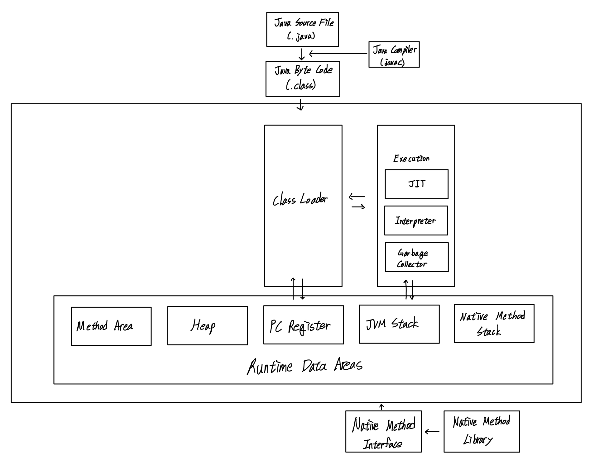

# JVM(Java Virtual Machine)
---

- 컴퓨터를 사용해 자바를 실행하기 위한 가상 컴퓨터
- 자바 프로그램이 기기, 운영체제에 상관없이 실행될 수 있도록 함
- 자바 프로그램 메모리를 관리하고 최적화
> 한 번 작성하면 어디서든 실행된다

### JVM에서 메모리 관리
1. 프로그램이 시작되면 JVM은 OS로부터 필요한 메모리를 할당 받고 JVM은 이 메모리를 용도에 따라 여러 영역으로 나누어 관리
2. 자바 컴파일러(JAVAC)가 자바 소스코드를 읽어 자바 바이트코드(.class)로 변환
3. 변환된 class 파일들을 클래스 로더를 통해 JVM 메모리 영역으로 로딩
4. 로딩된 class 파일들을 Excution engine을 통해 해석
5. 해석된 바이트 코드는 메모리 영역에 배치되어 실질적인 수행이 이루어짐. 이러한 과정 속 JVM은 필요에 따라 스레드 동기화나 가비지 컬렉션 같은 메모리 관리 작업 수행



```
* 참고 *
JIT 컴파일(Just-In-Time Compile): 바이트코드를 하드웨어의 기계어로 바로 변환해주는 기법

클래스로더(Classloader): 자바 클래스를 JVM 메모리 영역으로 동적 로드하는 자바 런타임 환경의 일부  
```

### 가비지 컬렉션
- JVM은 가비지 컬렉션이라는 프로세스를 통해 메모리 관리
- 실행 순서
  1. 참조되지 않은 객체들을 탐색 후 삭제
  2. 삭제된 객체의 메모리 변환
  3. 힙 메모리 재사용